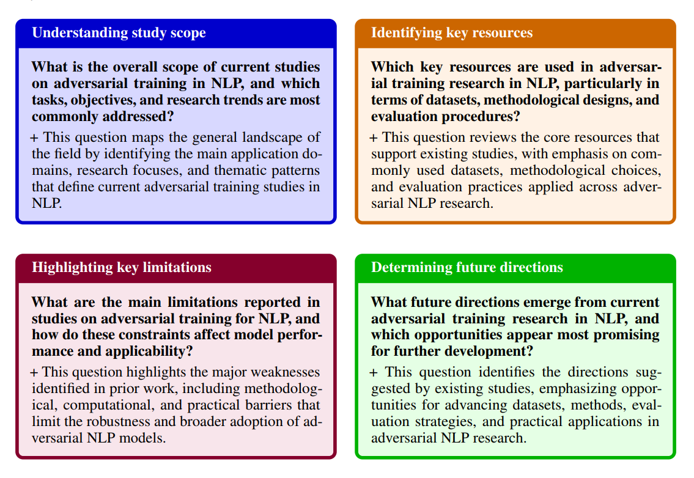
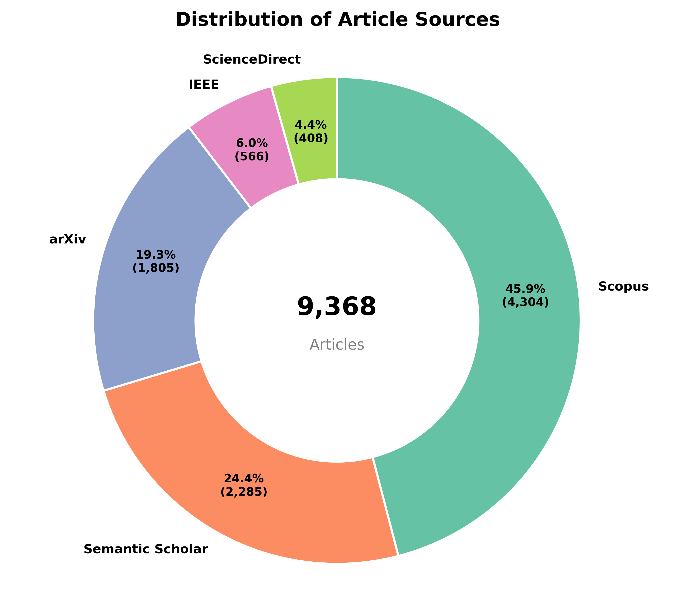
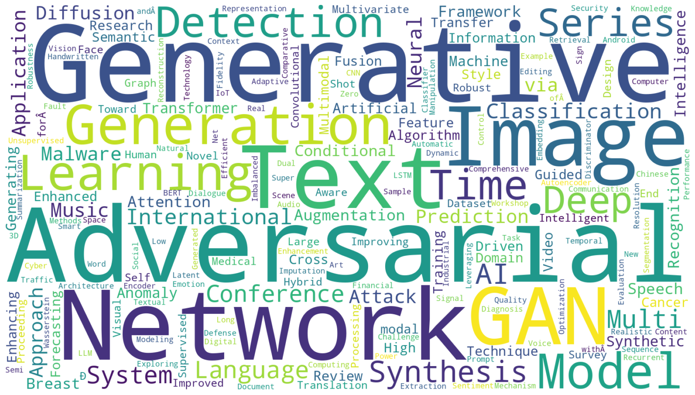
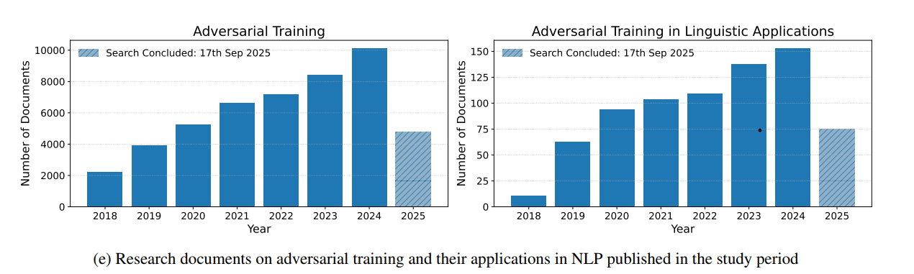
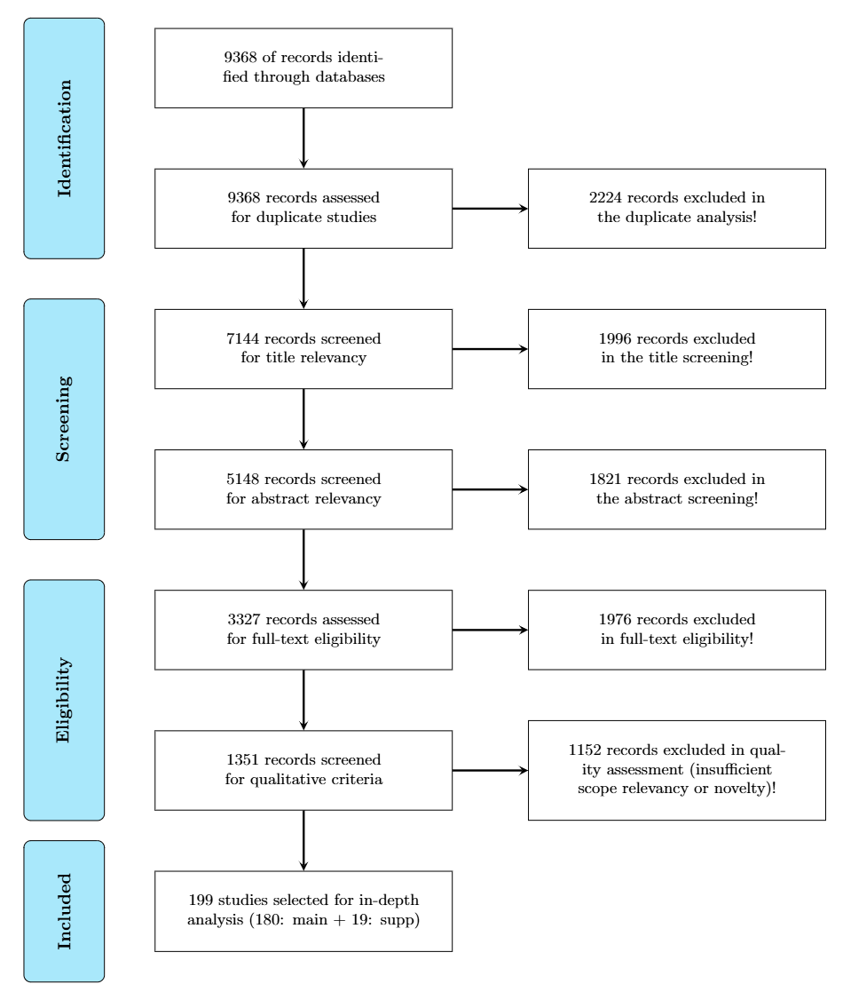
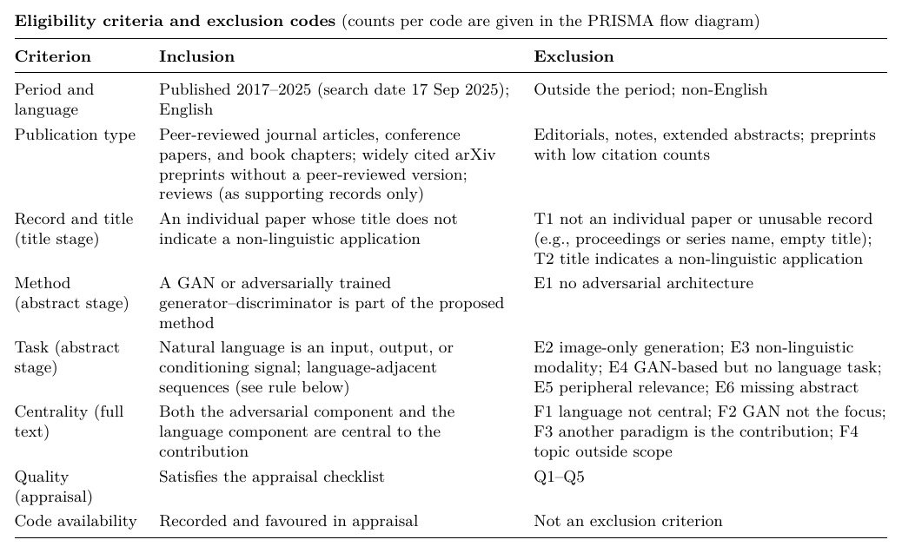
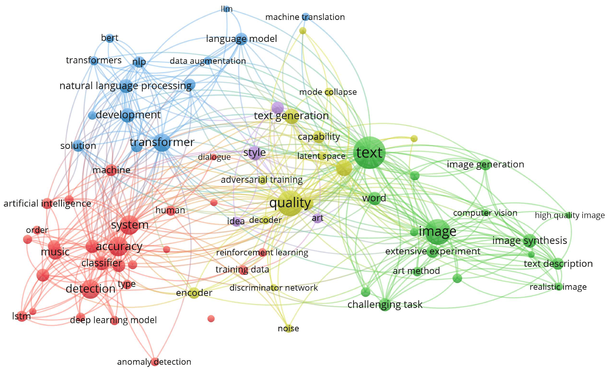

# GAN-for-NLP-Survey
EXPLORING ADVERSARIAL TRAINING FOR NATURAL LANGUAGE PROCESSING : A SYSTEMATIC REVIEW AND TAXONOMY

**Authors**: Mohammad Hossein Zolfagharnasab* & Amin Haghdadi, Siavash Damari, Hooshiar Zolfagharnasab, Ana F. Seqeira, Jaime S. Cardoso

**Corresponding author**: mohammad.h.zolfagharnasab@inesctec.pt

---

## Repository structure and study objectives

This repository accompanies the systematic review **“EXPLORING ADVERSARIAL TRAINING FOR NATURAL LANGUAGE PROCESSING : A SYSTEMATIC REVIEW AND TAXONOMY.”**  
The review is guided by a set of study objectives defined in the manuscript Introduction and operationalized through a structured set of research questions (RQs).

### Study objectives
The objectives of the review are to:
- Map the landscape of adversarial training applications in NLP, identifying key architectures and use cases.
- Assess the methodological rigor of existing studies through their evaluation depth and validation.
- Identify gaps in current research to guide future work.


### Research-question blocks
To ensure a transparent link between objectives and analysis, individual research questions are grouped into **RQ blocks**

  

Each RQ block corresponds one-to-one with a study objective and is used to structure the Results and Discussion sections.

---

## 1) Search strategy and literature retrieval

This section explains **where** the literature was retrieved from, and **how** the search queries were constructed to target the intended research space.

### 1.1) Selected Repositories and Rationale

- **Scopus** 
- **Arxiv** 
- **IEEE Xplore** 
- **SemanticScholar**
- **ScienceDirect** 

Equivalent **conceptual search logic** was applied across all repositories, with only syntax-level adaptations.

All retrieved records were merged into a single dataset representing the **PRISMA Identification** stage:

`prisma/01_articles_per_source/articles.csv`

The dataset contains title, authors, abstract, year, doi (when available), source.

---

### 1.2) Keyword design and search intent

The search strategy was constructed to deliberately target studies at the **intersection of Generative Adversarial Networks and Natural Language Processing**, ensuring both relevance and specificity.

Search terms were organized along three complementary dimensions:

  1. Core generative model
     
    GAN, GANs, Generative Adversarial Network, Generative Adversarial Networks, adversarial training

  2. Target application domain

    text, dialogue, music, time series, phishing, malware, sign language

  3. Search refinement criteria

    Publication period: 2017–2025
    Subject area: Computer Science
    Language: English

Only studies simultaneously addressing all three dimensions were eligible.

### 1.3) Search Rationale

The following blocks show the **exact logical structure** of the Scopus queries used in the study.  
Equivalent queries were executed on Arxiv, ScienceDirect, IEEE Xplore, and SemanticScholar with syntax adaptations only.

SQL-like representation:

    TITLE-ABS-KEY ( ( "GAN" OR "GANs" OR "generative adversarial network" OR "generative adversarial networks" OR "adversarial training" ) AND ( "text" OR "music" OR "time series" OR "phishing" OR "malware" OR "sign language" OR "dialogue" ) ) AND PUBYEAR > 2017 AND PUBYEAR < 2026 AND PUBYEAR > 2017 AND PUBYEAR < 2026 AND ( LIMIT-TO ( SUBJAREA , "COMP" ) ) AND ( LIMIT-TO ( LANGUAGE , "English" ) )

---

## 2) Analyzing the Retrieved Articles:

### 2.1) Distribution of retrieved literature across repositories

After merging all retrieved records, we analysed **repository-level contributions** to understand coverage, redundancy, and balance.



### Detailed interpretation

This distribution demonstrates that multi-source retrieval is essential for achieving comprehensive coverage and minimizing database-specific bias in adversarial training for NLP research.
- Scopus contributes the largest share of records, reflecting its broad coverage of computer science and AI research and establishing it as the primary retrieval source.
- Semantic Scholar provides complementary coverage, particularly for recent and cross-domain adversarial training NLP studies.
- ArXiv contributes emerging research, capturing preprints of novel adversarial training architectures and experimental approaches.
- IEEE Xplore and ScienceDirect add valuable peer-reviewed studies, mainly covering technical developments and journal-based contributions in machine learning and NLP.

This distribution confirms that the retrieval process is **not dominated by a single database** and that multi-source querying is necessary for this research topic.

### 2.2) Vocabulary analysis: validating the search strategy

To assess whether the keyword design and filters successfully captured the intended research space, we analysed the dominant terminology present in the retrieved corpus.



### Detailed interpretation

- Dominant terms such as Generative, Adversarial, Network, GAN, Image, and Deep confirm that the retrieved literature centers on deep generative modeling, particularly Generative Adversarial Networks and their architectural variants.
- The co-occurrence of Text, Image, Music, Video, and Multimodal indicates that the corpus spans multiple data modalities, reflecting a broad application scope for generative techniques.
- Frequent appearance of Detection, Classification, Medical, Cancer, and Diagnosis alongside generative terms shows the literature bridges generative modeling with real-world diagnostic and discriminative applications.
- The absence of dominant off-topic terminology suggests that the keyword design and inclusion criteria effectively isolated literature within the intended generative-AI scope.


---

### 2.3)  Evolution of the literature (2018–2025)

We analyzed the yearly publication trends, after removing duplicate records and articles without a specified publication year, to assess the maturity and growth dynamics of the field.



#### Key observations


We analyzed the yearly publication trends to assess the maturity and growth dynamics of adversarial training research and its adoption within linguistic (NLP) applications.

Adversarial Training (overall):

- 2018–2019: Foundational stage, moderate activity (2,209–3,930 publications)
- 2020–2021: Strong growth (5,278–6,625), reflecting increasing adoption of adversarial robustness techniques across machine learning
- 2022–2023: Sustained expansion (7,171–8,415), as adversarial training became a standard component of model robustness research
- 2024: Peak activity (10,125 publications), marking the field's consolidation as an established and widely applied research area
- 2025 (partial, through 17th September): 4,757 publications recorded so far, consistent with prior-year pace when annualized

Adversarial Training in Linguistic Applications:

- 2018–2019: Early stage, minimal activity (11–63 publications)
- 2020–2021: Rapid uptake (94–104), coinciding with the broader integration of adversarial methods into NLP pipelines
- 2022–2023: Continued growth (109–138), reflecting diversification into tasks such as text classification, robustness testing, and adversarial example generation
- 2024: Peak activity (153 publications), indicating that adversarial training has moved from a general ML technique to a well-established subfield within NLP
- 2025 (partial, through 17th September): 75 publications recorded so far, suggesting continued steady interest

---

## 3) PRISMA workflow and screening pipeline

All retrieved records entered a **PRISMA-compliant, fully auditable screening pipeline** specifically designed for a **cross-disciplinary systematic review** spanning computer science, engineering, and surgical sciences.  
The pipeline emphasizes **traceability, conservative exclusion, and reproducibility**, ensuring that every decision can be independently inspected and replicated.

Identification → Duplicate Removal → Title Screening → Abstract Screening → Full-Text Screening → Qualitative Screening → Inclusion



---

### 3.1) Review Rules and Guidlines

The table below summarizes the **quantitative evolution of the corpus** across PRISMA stages.  
Importantly, reductions at each stage are **intentional and methodologically motivated**, not arbitrary filtering.

| PRISMA stage | Records | Description |
|-------------|---------|-------------|
| Identified | 9,368 | Raw corpus aggregated from all repositories and manual backward searches |
| After duplicate removal | 7,144 | Redundant indexing across databases removed |
| After title screening | 5,148 | Clearly irrelevant or out-of-scope studies excluded |
| After abstract screening | 3,327 | Studies failing methodological relevance criteria excluded |
| Full-text assessed | 1,351 | Subset eligible for detailed methodological inspection |
| After qualitative screening | 199 | Studies meeting rigor, transparency, and comparability requirements |
| Final included | 199 | 180 primary (core analysis) + 19 supplementary (contextual support) |

Each numerical transition is supported by **explicit CSV decision logs**, ensuring full transparency.

### 3.2) Eligibility criteria

To minimize subjectivity and ensure consistency across reviewers, explicit eligibility criteria were defined a priori.

#### 3.2.1) Inclusion and exclusion criteria

Studies were included if they were published between 2017 and 2025, consisted of peer-reviewed research articles, reviews, books, or book chapters with accessible code repositories, and clearly addressed adversarial training applied to NLP or multimodal tasks, as reflected in the title, abstract, and full text. Studies were excluded if they fell outside this period, were low-citation non-peer-reviewed pre-prints, editorials, or short-format publications, or focused exclusively on image-based applications without NLP or multimodal relevance.



---

### 4) Stage-wise PRISMA screening details and artifacts

This subsection explains **why each stage exists**, **how decisions were made**, **which studies were excluded**, and **where the evidence for those decisions resides**.

---

#### 4.1) Identification — `prisma/01_articles_per_source`

**Rationale**  
Given the interdisciplinary nature of this work, the identification stage was intentionally **recall-oriented**. Missing relevant computational studies would be more harmful than temporarily including marginal ones.

**What happens here**
- Aggregation of all automated query outputs
- No quality or relevance judgment at this stage

**Why this matters**
- Prevents early bias toward publications
- Ensures visibility of emerging or hybrid research not consistently indexed

**Artifact**

| File | Description |
|-----|-------------|
| `articles.csv` | Complete raw retrieval with metadata (title, authors, abstract, year, doi, source) |

---

#### 4.2) Duplicate removal — `prisma/02_duplicate_removal`

**Rationale**  
The same study frequently appears across multiple repositories with slight metadata variations. Without explicit duplicate handling, downstream analyses (e.g., trends, distributions) would be distorted.

**How duplicates are detected**
- DOI matching ensures high-confidence identification
- Title similarity acts as a robust fallback for missing or inconsistent DOIs

**Decision principle**
- Only **one canonical record** is retained
- No study is excluded for scientific reasons at this stage

**Artifacts**

| File | Description |
|-----|-------------|
| `articles_duplicate_marked.csv` | All detected duplicate groupings |
| `articles_rejected_by_duplicacy.csv` | Records removed due to redundancy |
| `articles_after_duplicates.csv` | Clean, de-duplicated corpus |

---

#### 4.3) Title screening — `prisma/03_title_screening`

**Rationale**  
Title screening acts as a **first relevance filter**, removing studies that are unmistakably outside the review’s scope while preserving ambiguous cases.

**Why conservative exclusion is used**
- Titles often underspecify methods
- Overly aggressive filtering risks false negatives

**Typical exclusion logic**

- No GAN/adversarial-network architecture indicated
- No NLP/textual-language or multimodal application dimension
- No demonstrable paper content (junk/non-title entries — proceedings names, citation fragments, bare numbers)

**Artifacts**

| File | Description |
|-----|-------------|
| `articles_titles_screened_marked.csv` | Title-level inclusion flags |
| `articles_rejected_by_titles.csv` | Excluded records with reason labels |
| `articles_after_title_screening.csv` | Retained set for abstract review |

---

#### 4.4) Abstract screening — `prisma/04_abstract_screening`

**Rationale**  
Abstract screening enforces domain and methodological relevance and formalizes the adversarial training for NLP inclusion criteria used throughout the review.

**Key evaluation questions**
- Is a adversarial-network architecture explicitly described in the methodology?
- Is the application domain textual/linguistic, rather than vision, audio, medical, security, time-series, or another non-NLP field?
- Is the abstract substantive enough to assess relevance (not missing, corrupted, or a citation/proceedings fragment)?

**Why this stage is critical**
- Prevents inclusion of studies that only mention computation superficially
- Aligns the corpus with the analytical structure of the review

**Artifacts**

| File | Description |
|-----|-------------|
| `articles_abstract_screened_marked.csv` | Abstract-level decisions |
| `articles_rejected_by_abstract.csv` | Excluded studies with rationale |
| `articles_after_abstract_screening.csv` | Corpus entering full-text review |

---

#### 4.5) Full-text screening — `prisma/05_fulltext_screening`

**Rationale**  
Focus screening enforces topical centrality and filters out papers where adversarial training/NLP terminology appears only incidentally rather than as the actual subject.

**Assessment focus**
- Is adversarial training text generation the paper's primary contribution, or a passing mention?
- Does a competing method (diffusion, RL, LLMs-in-general, etc.) dominate the framing instead?
- Is the language/text or multimodoal component central to the work, or a minor detail?

**Why exclusions occur here**
- Abstracts may overstate contributions
- Full text may lack sufficient detail for comparison or synthesis

**Artifacts**

| File | Description |
|-----|-------------|
| `articles_full-text_screened_marked.csv` | Full-text eligibility decisions |
| `articles_rejected_by_full-text.csv` | Excluded studies with explicit reasons |
| `articles_after_full-text_screening.csv` | Studies retained for quality assessment |

---

#### 4.6) Qualitative / quality screening — `prisma/06_qualitive_fulltext_qualitive`

**Rationale**  
Not all technically valid studies are equally useful for comparative synthesis.  
This stage prioritizes **substantive, interpretable, and transferable contributions**.

**Quality is assessed along multiple axes**
- Methodological rigor (evaluation metrics, comparison against baselines, ablation studies)
- Evidentiary depth (whether claims are backed by concrete numbers vs. asserted qualitatively)
- Dataset and evaluation transparency (single vs. multiple datasets, reported evaluation scope)
- Comparative standing relative to the retained set (how the paper's evaluation depth stacks up against the strongest included papers)

**Exclusions at this stage**
- Do not indicate poor science
- Reflect limited comparative or analytical value

**Artifacts**

| File | Description |
|-----|-------------|
| `articles_qualitive_screened_marked.csv` | Quality decisions |
| `articles_rejected_by_quality.csv` | Excluded studies with rationale |
| `articles_after_qualitive_screening.csv` | Final high-quality corpus |

---

### 4.7) Final inclusion and synthesis artifacts

The final corpus is structured to **directly support analysis, comparison, and discussion**.

**Included studies**

| File | Description |
|-----|-------------|
| `prisma/07_candidate_papers/candidate_papers.csv` | Definitive list of included studies |

---

**Overall methodological takeaway**

- Screening decisions are **progressive, conservative, and justified**
- Every exclusion is **documented and reversible**
- All artifacts are **machine-readable, immutable, and version-controlled**
- The pipeline supports **independent audit, replication, and extension**

This PRISMA implementation is therefore not only compliant, but **operationally transparent and computationally reproducible**.

**Conceptual structure of retained literature**



### Interpretation of the keyword co-occurrence network

The co-occurrence network offers a compact view of the conceptual organization of the retained adversarial training in NLP literature, showing how methodological, architectural, and application concepts interconnect.

- **Modular but connected structure**
  - Four main thematic clusters (NLP/transformers, detection/classification, GAN, text-image generation) with dense inter-cluster links
  - Reflects a genuinely cross-cutting field rather than isolated sub-topics
- **Central bridging concepts**
  - text, quality, adversarial training
  - Link language modeling techniques to generative/adversarial methodology
- **Main clusters**
  - NLP foundations: transformer, BERT, language model, NLP, LLM, machine translation
  - Detection/classification: system, accuracy, detection, classifier, LSTM, anomaly detection
  - GAN training & evaluation: adversarial training, discriminator network, latent space, mode collapse, quality
  - Generation/multimodal output: text generation, image synthesis, text description, realistic image
- **Key implication**
  - Language modeling and adversarial training methods are tightly coupled, not separately studied
  - Detection/classification work reuses the same adversarial training machinery as generation work
  - The structure supports the review's framing of adversarial training as a unifying technique across diverse NLP tasks

---

## 5) Repository hierarchy

review paper tree
```
├── README.md
├── figs
│   ├── Distribution_of_Sources.png
│   ├── InclusionExclusion.png
│   ├── prisma.png
│   ├── RQ.png
│   ├── WordCloud_Articles.png
│   ├── graph.png
│   └── years_stats_articles.png
└── prisma
    ├── 01_articles_per_source
    ├── 02_duplicate_removal
    ├── 03_title_screening
    ├── 04_abstract_screening
    ├── 05_fulltext_screening
    ├── 06_qualitative_fulltext
    └── 07_candidate_papers
```
# GAN4NLP-Survey
